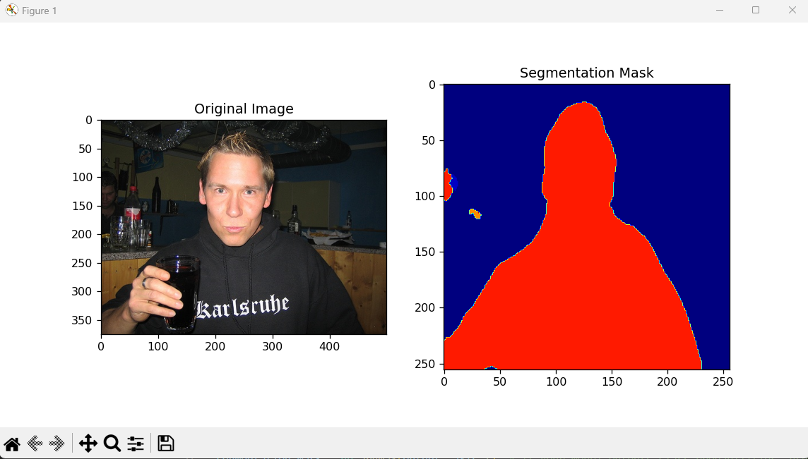

# Unet-Semantic_Segmentation
Dicescore: 66%

## Install: ##
```bash
git clone https://github.com/hotonbao/Unet-Semantic_Segmentation.git
cdUnet-Semantic_Segmentation
```
## Test: ##

```
python Test.py
```

Output

